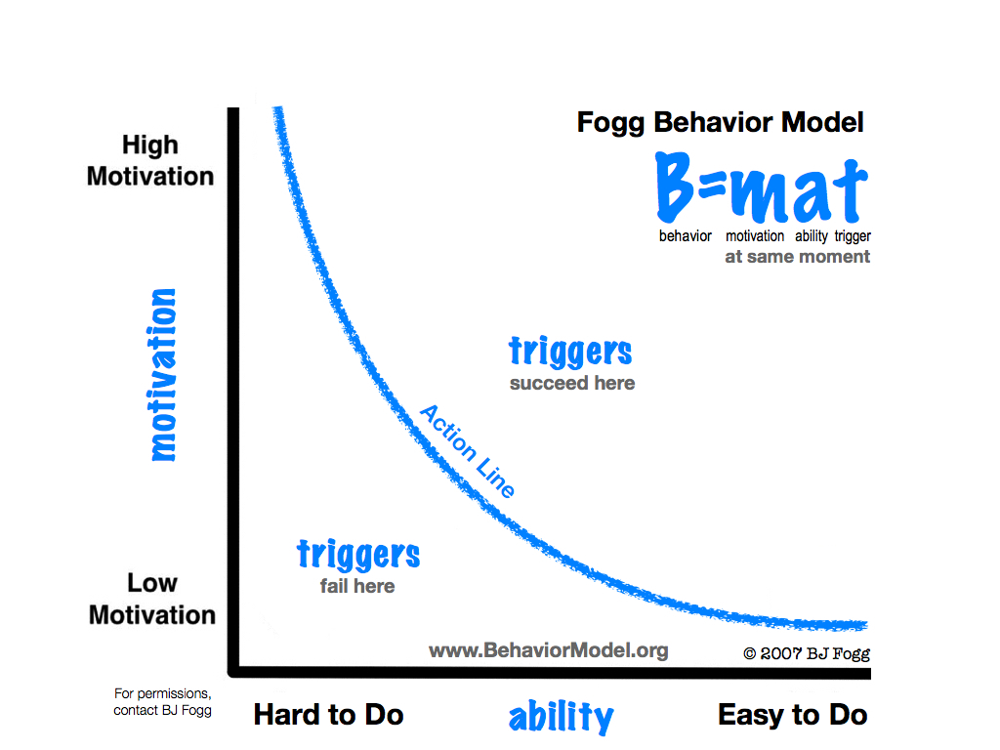

# Hoe kan ik gebruikers terug laten komen naar het platform?

## Gamification

Doormiddel van gamification is er een mogelijkheid om gebruikers naar je platform terug te laten komen. Zo kan je door middel van een beloning systeem gebruikers motiveren om door te gaan met de acties die daar bij komen kijken.

Met een platform als goede doelen zou ik hier graag gebruik willen maken om de gebruiker het gevoel te geven dat niet alleen de goede doelen winnen, maar ook de gebruiker zelf. Door de gebruiker dit gevoel te geven is de kans groter dat hij/zij bewuster met de donaties omgaat dan dat dat nu gebeurd.

[https://computerworld.nl/management/78236-4-gouden-gamification-tips](https://computerworld.nl/management/78236-4-gouden-gamification-tips)

[https://www.dieponderzoek.nl/top-10-meest-aantrekkelijke-gamification-elementen-op-basis-van-wetenschappelijk-onderzoek/](https://www.dieponderzoek.nl/top-10-meest-aantrekkelijke-gamification-elementen-op-basis-van-wetenschappelijk-onderzoek/)

## **Persuasive Design**

Wanneer je persuasive design letterlijk vertaald betekent het ‘overtuigend ontwerp’. Deze term richt zich op het beïnvloeden van beslissingsproces van de mens. Hier maakt het gebruikt van overtuigingsprincipes. Wat ze hopen te bereiken is het veranderen van het gedrag van de consument.

De bekendste persoon op gebeid van overtuigingsprincipes zijn die van Robert Cialdini. De zes wapens van van invloed. Deze zes zijn: Wederkerigheid, Commitment en Consistentie, Sociale Bewijskracht, Autoriteit, Sympathie en Schaarste. Hieronder een korte samenvatting over wat elk begrip nou precies inhoud.

#### Wederkerigheid

Mensen zijn eerder bereid iets geven als ze eerst iets ontvangen hebben. Met andere woorden is het verstandig om de gebruiker die voor het eerst op een platform komt bijvoorbeeld koriting te geven. Hiermee kan je er eventueel voor zorgen dat de gebruiker een positieve ervaring krijgt en daardoor iets terug wilt doen, bijvoorbeeld door een aankoop.

#### Commitment en Consistentie

Mensen zijn eerder bereid ergens voor terug te keren. bijvoorbeeld door middel van een loyaliteitsprogramma.

#### Sociale Bewijskracht

Mensen doen vaak mensen na, als vertelt wordt dat iets heel goed is, is de kans groot dat ze dat aannemen en dan zelf actie ondernemen. Hier kan je gebruik maken van een rating systeem of te laten zien waar gebruikers voor gekozen hebben hebben.

#### Autoriteit

Mensen nemen eerder iets aan van personen die ergens verstand van hebben of een bepaalde status hebben gekregen op een bepaald onderwerp. Gebruikers willen graag van een expert het advies op volgen, omdat ze dan \(denken\) te weten dat dat het juiste is. Door zo'n iemand te volgen draag je daar ook een bepaalde uitstraling met je mee.

#### Sympathie

Als we onze vrienden ergens over inlichten zijn ze eerder bereid om 'Ja' te zeggen. Dit geld ook bij personen waar we ons mee kunnen identificeren.

#### Schaarste

Door middel van exclusiviteit zijn mensen eerder geneigd om een product eerder te kopen, maar er ook meer voor te betalen. Dit alles heeft te maken met vraag en aanbod. Als de vraag hoger is dan het aanbod wordt het schaars, waardoor je meer voor een product kan vragen en waardoor het ook meer waard wordt. Bij een platform kan je hier op inspelen door bijvoorbeeld 'Laatste kans' of 'nog 2 beschikbaar' te tonen, waardoor gebruikers het gevoel hebben dat er een kans bestaat dat ze iets unieks mislopen.

#### Conclusie

Wat ik mee neem in mijn design zijn de begrippen: Wederkerigheid \(in combinatie met Gamification\), Sociale bewijskracht en Sympathie. Ik denk dat ik doormiddel van een medaille systeem gebruikers iets kan geven, waardoor ze het gevoel krijgen dat ze er iets voor terug moeten doen. Door bijvoorbeeld alleen al een account aan te maken zou de gebruiker al meteen een medaille kunnen ontvangen. Sociale bewijskracht kan ik toepassen in de vorm van een lijst met populaire goede doelen waar veel mensen aan doneren. Door dit in beeld te brengen zullen gebruikers eerder geneigd zijn om ook te doneren. Als laatste is sympathie een goede manier om bewust te worden waar jou vrienden aan doneren. Hier speelt privacy wel een rol waar ik zeker rekeing mee moet houden.

#### Links

[https://www.marketingfacts.nl/berichten/overtuigd-beinvloed-door-persuasive-design](https://www.marketingfacts.nl/berichten/overtuigd-beinvloed-door-persuasive-design)

[https://www.comaxx.nl/ux-conversie/cialdini/](https://www.comaxx.nl/ux-conversie/cialdini/)

## BJ Fogg Model

Uiteindelijk is alleen terug komen naar het platform niet genoeg. Het is ook van belang dat er daadwerkelijk een actie uitgevoerd wordt door de gebruiker. Op mijn stage ben ik het 'BJ Fogg model' tegen gekomen en heb hier ook wat meer onderzoek naar gedaan. Het model heeft ook te maken met gedragsbeinvloeding. Het gaat over 'Motivation, Trigger, Ability. 

Het model, dat hieronder te zien is, is niet zo heel moeilijk als je er rustig naar kijkt. Het model zegt dat hoe hoger de motivatie, hoe meer moeite gebruikers willen doen om over te gaan tot actie. Andersom werkt het ook, als de actie om te doen, niet moeilijk is, hoeft de motivatie ook niet enorm hoog te zijn, omdat het de gebruiker \(bijna\) geen moeite kost.

Wat ik hier uit wil meenemen is dat ik het voor de gebruiker zo makkelijk mogelijk moet maken om te kunnen doneren, zonder dat veel extra handelingen aan zijn verbonden.

**Links**

[https://smart-online-marketing.nl/conversie/gedragsbeinvloeding/](https://smart-online-marketing.nl/conversie/gedragsbeinvloeding/)

[https://www.crow.nl/mobiliteit-en-gedrag/weblog/april-2013/xx](https://www.crow.nl/mobiliteit-en-gedrag/weblog/april-2013/xx)

