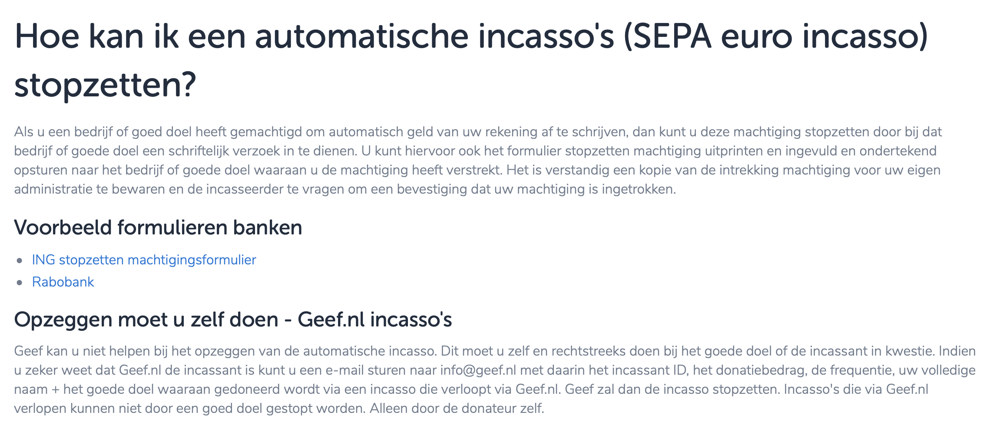

# Hoe kan je een automatische incasso stopzetten?

In mijn interviews ben ik een paar keer tegen gekomen dat het een gedoe is om een automatische afschrijving te annuleren. Nu ben ik op onderzoek gegaan en gekeken of dit ook daadwerkelijk zo ingewikkeld is. Zelf heb ik voor dit project via 'geef.nl' een jaarlijkste donatie aangemaakt en deze wil ik ook weer stop zetten.

### **Stap 1: Website geef.**

Door naar de website te gaan en vervolgens in de helpdesk te zoeken over het stopzetten van mijn automatische incasso wordt mij vertelt dat ik dit schriftelijk af te doen naar het desbetreffende goede doel. Hieronder is de website te zien.

[https://www.geef.nl/nl/page/machtiging-stopzetten](https://www.geef.nl/nl/page/machtiging-stopzetten)

\*\*\*\*

### **Stap 2: Website WarChild**

Als ik naar de website  van WarChild ga is het alleen mogelijk om de donatie stop te zetten door middel van telefonisch contact. Er worden hier twee verschillende manieren vertelt.

[https://www.warchild.nl/wijzigen-donatie/](https://www.warchild.nl/wijzigen-donatie/)

### **Stap 3: website Opzeggen.nl**

Als ik ga googlen om een goed doel op te zeggen kom ik weer terug bij de optie om het schriftelijk af te handelen. Zij hebben een platform waarbij je alleen de gegevens hoeft in te vullen en dan genereerd opzeggen.nl een brief met alle informatie die nodig is.

[https://www.opzeggen.nl/goed-doel/warchild/opzeggen](https://www.opzeggen.nl/goed-doel/warchild/opzeggen)

### **Conclusie**

het wordt je als gebruiker niet makkelijk gemaakt om een automatische incasso te annuleren. Gezien de goede doelen is dit wel begrijpelijk, omdat ze liever niet willen dat een donateur hiermee stopt. Echter is het wel zo dat ik in mijn onderzoek \(Survey + Interviews\) ben tegen gekomen dat dat ook de reden is waarom potentiele donateurs niet overstag gaan. Het is dus van twee kanten te bekijken.

