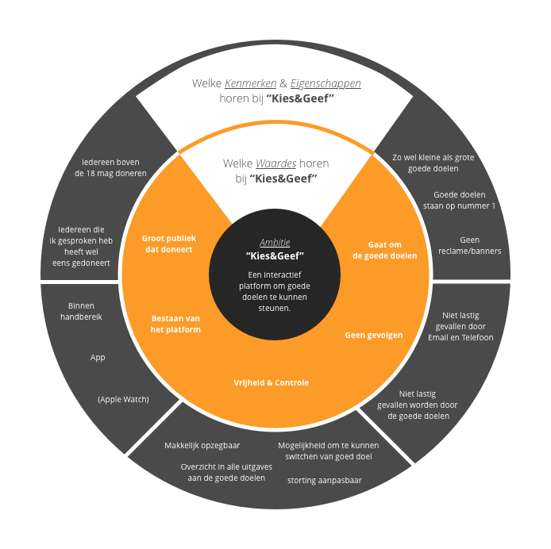
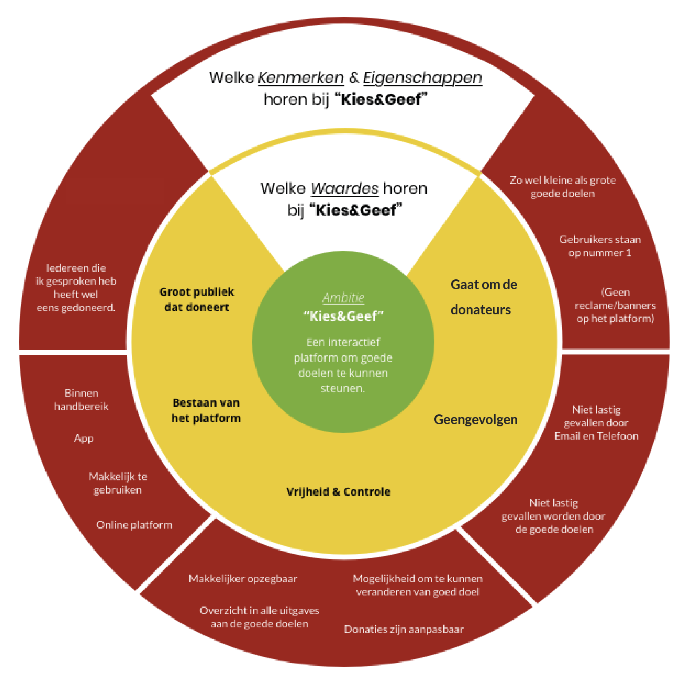

# Waar staat mijn product voor?

Tijdens de brainstorm sessie zijn we gaan nadenken waar voor we willen staan als dienst. Waar zijn onze USP’s? Met deze vragen ben ik op het idee gekomen om hier achter te komen via een brandeye.

Resultaat

Gebruikers komen op de eerste plaats. Het gaat over donaties doen aan goede doelen, maar willen een platform \(app\) creëren dat compleet geoptimaliseerd is voor de donateur.

We willen gebruikers niet ‘lastig’ vallen. Zowel in de survey als bij de interviews ben ik tot de conclusie gekomen dat donateurs het als vervelend beschouwen als ze thuis, aan de deur of aan de telefoon, of op straat worden aangesproken. We willen als platform niemand dwingen.

Het is een vrijblijvend platform, het is aan de donateur om te bepalen hoeveel hij wilt geven. De donateur kan op elk moment de donaties stopzetten of wijzigen.

Volgens mijn baas komt bij immense 60% van het online verkeer binnen door middel van een mobiele telefoon. Wij hebben daarom besloten om een app te ontwikkelen. Zo regelen Nederlanders steeds meer financiële zaken met de telefoon blijkt uit een artikel \(TomorrowMobile, 2019\) dat is gebaseerd uit het onderzoek ‘Trends in Digitale Media’ van het onderzoeksbureau GfK.

### Versie 1

Dit is een verkeerde brandeye, omdat de focus bij deze brandeye verkeerd ligt.

### Versie 2

