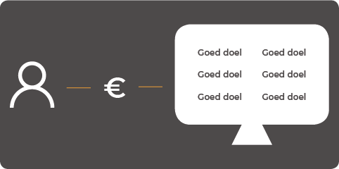

# Design Brief



## Intro

Afgelopen paar jaar komen er steeds vaker collecteurs bij mij aan de deur met allemaal het zelfde doel. Ze willen dat ik teken voor een maandelijkse afschrijving en zo mijn steentje kan bij dragen voor een goede doelen organisatie. Zelf wil ik graag een kleine financiële bijdrage leveren, bij een collectebus doe ik dit ook altijd, mits ik nog klein geld in huis heb, maar wil ik uit principe nergens voor tekenen. Er zijn vermoedelijk twee verschillende redenen, waarom ze bij mij in de wijk zijn overgestapt van de collectebus naar abonnement diensten.

Als eerst speelt het risico om te worden overvallen een erg grote rol. Er zit ongeveer rond de €50,- a €150,- euro in een collectebus. Dit weet ik nog van in de tijden dat mijn moeder collecteerde voor het Astma Fonds, tegenwoordig Longfonds.

Daarnaast willen goede doelen organisatie meer geld genereren en verdienen meer aan elke maand vijf euro dan eenmalig een tientje. uiteindelijk levert dit meer geld op en zijn ze verzekerd voor komende inkomsten in de toekomst.

Wanneer ik aangeef dat ik nergens aan vast wil zitten, meldt de persoon bij mij aan de deur meteen dat het mogelijk is om na een maand weer te kunnen afmelden. Toch merk ik aan mijzelf dat ik dit niet aantrekkelijk vind, omdat ik zelf niet extra moeite wil doen om het abonnement weer stop te zetten, waarbij ik het risico loop om het te gaan vergeten en daarnaast me schuldig ga voelen om het geld terug te vragen. Uiteindelijk betaal ik veel meer dan ik eigenlijk zou willen.

## Het probleem

**Beschrijving van de opdrachtgever, investeerder, belangenvereniging**

Mijn opdrachtgever is Immense en kan bepaalde eisen aan de opdracht stellen. Zij hebben ook meer verstand van het omgaan met goede doelen organisaties. Ze hebben mij er op gewezen dat goede doelen organisaties vrij arrogant kunnen zijn. Ze zijn erg kritisch met wie ze in zee willen gaan om zo een goede naam te behouden. Als een bedrijf waaraan ze zijn gekoppeld een slechte naam krijgt, krijgt het goede doel automatisch ook een slechte naam. 

**Beschrijving van de gebruiker / doelgroep**

Zoals ik bij de introductie al aangaf komen tegenwoordig steeds meer collecteurs langs voor goede doelen organisaties die willen dat je tekent. Persoonlijk \(en om mij heen\) vind ik dit erg vervelend. Ik wil me richten op ieder huishouden die gemachtigd is te tekenen en ook zo af en toe bereid is om financiële steun te bieden aan deze organisaties.

**Beschrijving/schets van het probleem / behoefte voor zover ik dit nu begrijp**

Het probleem wat ik zie is dat er weinig tot geen controle is over de financiële steun die ik als consument wil geven aan goede doelen organisaties. Voordat ik het weet zit ik aan meerdere organisaties vast en worden er verschillende bedrVagen \(automatisch\) van mijn rekening gehaald, waardoor ik er geen grip meer op heb. Omdat je tegenwoordig aan \(maandelijkse\) abonnementen vastzit kan ik door financiële redenen niet voor nog drie verschillende goede doelen een abonnement afsluiten. Ik ben hierdoor niet vrij in mijn keus, omdat ik aan één vast zit. 

Ik heb in mijn buurt, om mij heen en op kantoor bij Immense mijn probleem voor gedaan en gevraagd of zij dit ook ervaren. Ik heb hierbij ook vertelt welke kant ik op wil om dit probleem op te lossen en kreeg van meerdere personen te horen dat ze dit zien zitten en dit ook echt ervaren.

## **De context**

**De gebruiker**

Ik wil me met dit project volledig focussen op de gebruiker. Ik wil de gebruiker meer vrijheid en meer controle geven over het financieel steunen van een en/of meerdere goede doelen. Zelf word ik thuis enorm veel ‘lastig’ gevallen met collecteurs die mij een abonnement willen laten afsluiten. Het is dus niet moeilijk om de gebruiker dicht bij huis te zoeken en in en rond mijn omgeving. 

**Goede doelen**

Ook de goede doelen zijn een belangrijke stakeholder. Via mijn opdrachtgever kan ik in gesprek komen met verschillende goede doelen om zo belangrijke informatie te verkrijgen. Ook zijn ze een meter om te bepalen of ik op de goede weg ben.

**Concurrentie**

Het idee wat ik ongeveer wil gaan neer zetten ben ik nog niet tegen gekomen op het internet. Wel ben ik verschillende platformen tegengekomen die ook bezig zijn met meerdere goede doelen om mensen bewust te laten worden van welke goede doelen er zijn en hoe je geld kan doneren. Zo heb je de website https://goededoelen.nl en https://www.geef.nl/nl waar ik verder in het document een analyse over geef. 

Goededoelen.nl geeft een overzicht van alle goede doelen weer. Hier vind je informatie over\(bijna\) alle goede doelen die er zijn. Ze vertellen waar ze voor staan en wat ze willen bereiken. Als de gebruiker van plan is te doneren wordt je door gelinkt naar de pagina van het desbetreffende goede doel, waar je je weer kan inschrijven voor een maandelijkse donatie of een enkele donatie. Hierbij blijft het probleem dat je een beter overzicht krijgt over jou donaties die je wilt doen. 

Geef.nl is zeker wel een ‘concurrent’. Ze geven de mogelijkheid om als gebruiker verschillende donaties te doen, maar ook om verschillende acties te steunen. Het steunen van acties is ook hun hoofddoel. Je kan wel kiezen om maandelijks geld over te maken, maar ze zijn, door eigen research, een tussen persoon. Je kan achteraf niet meer bij hun wijzigen of aanpassen. Ook wanneer je kiest voor een automatische incasso krijg je geen overzicht over waar je lid van bent en wanneer er geld wordt afgeschreven. Zo is geef.nl wel degelijk een concurrent, maar zijn ze zeker niet de oplossing waar ik naar op zoek ben.

**Immense**

Immense, mijn opdrachtgever, gaat mij begeleiden met verschillende stappen. Immense kan mij helpen om verschillende contacten te leggen en om mij te helpen of sommige oplossingen wel echt realiseerbaar zijn. Zoals ik al vertelde hebben zij ook meer ervaring in het omgaan met bepaalde goede doelen organisaties.

## **Trend & Ontwikkeling**

**Geld in huis**

Zoals ik bij me zelf al merkte dat ik weinig tot geen kleingeld meer op zoek heb valt dit ook in het rapport ‘Van donatie naar relatie’ van het ING Economisch Bureau af te lezen. Hieruit blijkt ook dat 52% van de consumenten \(bijna\) nooit contant \(klein\)geld meer in huis heeft en wordt er steeds meer betaald met een contactloze betaalpas. Hierdoor is ook het inzamelen van collecten de afgelopen jaren fors afgenomen.

Voor dit probleem is ook de collectebus met contactloos betalen uitgevonden alleen vind ik dit nog niet een oplossing voor mijn probleem. Hierdoor houd je als gever geen overzicht en hebben de goede doelen niet de ‘vaste’ inkomsten die ze liever hebben. \(Redactie Dutchcowboys, 2016\)

**Aan de deur**

Steeds zie je het probleem regelmatig terug komen in verschillende fora en ook in een artikel op de website van deze bron \(Reformisch Dagblad, 2018\). Een artikel dat gaat over het verkopen aan de deur van verschillende abbonementen.

## Design Challenge \(2.0\)

“**Hoe kan** een interactief product **voor** mensen die af en toe bereid zijn om financiële steun te bieden aan goede doelen organisaties **zorgen voor** een overzichtelijke manier om geld te doneren naar één en/of meerdere goede doelen **waarbij** de eind gebruiker alle vrijheid heeft?”

## Focus

**Doelgroep**

Tijdens dit project wil ik me focussen op de gever en niet op de goede doelen organisaties. Ik ben van mening van hoe makkelijker het voor de gever is om te doneren, hoe vaker dit ook gedaan word. Waarbij de goede doelen organisaties uiteindelijk van profiteren.

**Goede doelen organisaties**

Tijdens mijn onderzoek wil ik wel degelijk in contact komen met minimaal één organisatie om mijn oplossing te pitchen en bij wie ik ook terecht kan voor verschillende vragen. Mijn opdrachtgever gaf ook aan dat het vrij simpel wordt om ‘Make a Wish’ om de tafel te krijgen en ze eventueel zo ver kunnen krijgen om ze als ‘Pilot’ te gebruiken.

**UX / UI Design**

Verder focus ik me tijdens dit project op het platform zelf. Hoe zit het systeem in elkaar? Hoe gaat het uiteindelijk werken? en Hoe ziet het systeem er uiteindelijk uit? zijn verschillende vragen die ik me ga afvragen gedurende het project. Ook is dit terug te zien in mijn planning, waarbij ik veel wil gaan testen met gebruikers of het systeem wel echt zo overzichtelijk is als ik denk bijvoorbeeld.

## Product visie

**Wat zou een goede oplossing zijn als je kijkt naar de behoeftes van alle stakeholders?**

Als oplossing wil ik werken naar een platform, waarbij de gebruikers alle vrijheid hebben om geld te kunnen doneren, waarbij ze ook inzicht hebben in hoeveel er uitgaat en naar welk goed doel dit gaat. Het streven is om zo transparant te zijn naar de gebruiker, maar dat de gebruiker ook een transparant beeld krijgt. 

**Welke beperkingen gelden er voor je oplossing?**

Zelf wilde ik zo veel mogelijk vrijheid creëren voor de gebruiker. bijvoorbeeld dat de gebruiker geld kan storten, maar ook weer terug kan storten. Mij is verteld dat bij elke transactie geld in rekening gebracht word en dat je daardoor de gebruiker alleen maar kan laten storten naar het platform. Een van mijn onderzoeksvragen gaat hier ook over. Wie gaat opdraaien voor de transactie kosten.

**Welke kansen moeten onderdeel zijn van je oplossing?**

Controle, vrijheid en inzicht in de uitgaves van een consument naar goede doelen. Ik wil ook niet dat er vier verschillende bedragen van een rekening gehaald worden, maar één bedrag van de consumenten rekening en dat het via het platform naar verschillende rekeningen van goede doelen organisaties overgemaakt wordt.

**Welke doelen moet je bereiken?**

Uiteindelijk wil ik een platform hebben staan, op papier, met daarbij een werkend prototype. Hopelijk is mijn opdrachtgever nog steeds enthousiast en zien ze er wel iets in om er uiteindelijk mee aan de slag te gaan, waardoor het ook gaat leven.

**Mijn product visie**

Een interactief product waarbij de gebruiker inzicht en controle krijgt over het financieel steunen van één of meerdere goede doelen organisaties, waarbij het bedrag aanpasbaar is.

## Huidige situatie

## Toekomstige situatie

## Mogelijke impact

**Ethische problemen voor bij de oplossing**

Gebruikers die gebruik maken van mijn ontworpen platform hebben een overeenkomst met het platform en hebben niets te maken met de goede doelen. Hierbij zouden goede doelen minder inzicht hebben in wie er lid is en wie er geld doneert. Als de goede doelen samen met ons werken zou in de toekomst hier geen probleem meer over ontstaan, omdat gegevens uitgewisseld kunnen worden. Hierbij speelt privacy wel een grote rol, maar denk op dit moment dat het niet extreem veel kwaad kan als een goede doelen organisatie weet wie er geld doneert, adresgegevens enz. zijn daarbij niet noodzakelijk.

**Ethische problemen voor bij het probleem** 

**Vastzitten**

Mensen willen graag wel geld doneren, maar ze willen hier niet aan vast zitten. De meeste mensen die ik heb gesproken omtrent dit probleem willen meer vrijheid zodat ze geen verplichtingen meer hebben aan één goed doel, maar willen de keuze hebben om makkelijk te switchen.

**Welk goede doel?**

Ook heb ik vaker te horen gekregen naar het feit dat gebruikers niet kunnen kiezen, omdat er te veel goede doelen organisaties zijn.

## Belangrijkste mijlpalen

Mijn project wil ik opdelen in vier verschillende fases. Mijn fases zijn Verkenning, Ideeontwikkeling, Ontwerp en Validatie. Eigenlijk kan je validatie ook onder verdelen in de Ontwerpfase, maar ik wil hier alsnog een losstaande fase van maken om mijzelf genoeg tijd te geven en zo ook te benadrukken om het eindproduct goed te finetunen en alle fouten er uit halen.

**Verkenningsfase**

In deze fase ga ik mijn doelgroep goed analyseren om zo er achter te komen, door middel van verschillende tools, wat nou exact het probleem is en waar nou echt een oplossing voor gevonden moet worden. In deze fase is de kans ook het grootse waar mijn design challenge nog een aantal keer zou kunnen veranderen.

**Ideeontwikkeling**

Bij de ideeontwikkeling ga ik kijken wat nou een geschikte oplossing voor het probleem is. Hier wil\] ik ook drie verschillende concepten bedenken en hieruit de beste kiezen en/of de beste van de drie concepten samenvoegen om zo een geschikt product neer te zetten.

**Ontwerpfase**

Hierin ga ik mijn beste concept verbeteren en finetunen, waarbij ik steeds dichterbij een antwoord kom op mijn design challenge. Ook krijgt het concept in deze fase een look&feel die aansluit bij de gebruikersgroep.

**Validatie**

Tijdens deze fase ga ik het product wat ik heb nogmaals een helemaal doorlopen en testen. Is het wel echt een antwoord op de design challenge.

## Planning

## Onderzoeksvragen

**Verkenningsfase**

* - Wat is het grootste probleem?
* Hoe geven mensen graag aan goede doelen / wat vinden zij een prettige manier?
* Wat is/zijn de belangrijkste redenen om niet vast te willen zitten aan het zelfde goede doel en hoe kan ik dit ****voorkomen?
* Zijn er al goede voorbeelden online?
* Hoe hoog kunnen de transactie kosten oplopen?

**Ideeontwikkeling**

* Hoeveel vrijheid en controle is gewenst als we kijken naar alle stakeholders?
* Welke mogelijkheden zijn er om geld over te maken?
* Wie draait er op voor de transactie kosten bij elke geld transactie?

**Ontwerpfase**

* Waar voelt de gebruiker zich vertrouwd bij?
* Is het ontwerp vrij te gebruiken? Zitten er voorwaarden aan vast?
* In hoeveel stappen moet het proces zijn afgerond in de ‘happy flow’?
* 
**Validatie**

* Is het antwoord op de ‘Design Challenge’ beantwoord?

## **Bibliografie**

* Redactie Dutchcowboys. \(2016, 29 december\). Geen kleingeld meer nodig met de contactloze collectebus. Geraadpleegd op 14 februari 2019, van https://www.dutchcowboys.nl/mobile/ geen-kleingeld-meer-nodig-met-de-contactloze-collectebus 
* Reformisch Dagblad. \(2018, 4 januari\). Colporteur van goed doel aan de deur kan blijmoedige gever ontmoedigen. Geraadpleegd op 18 februari 2019, van https://www. rd.nl/opinie/commentaar/colporteur-van-goed-doel-aan-de-deur-kan-blijmoedige-gever- ontmoedigen-1.1457867

