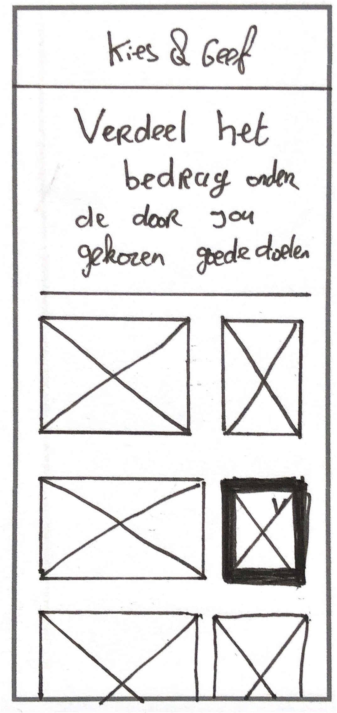
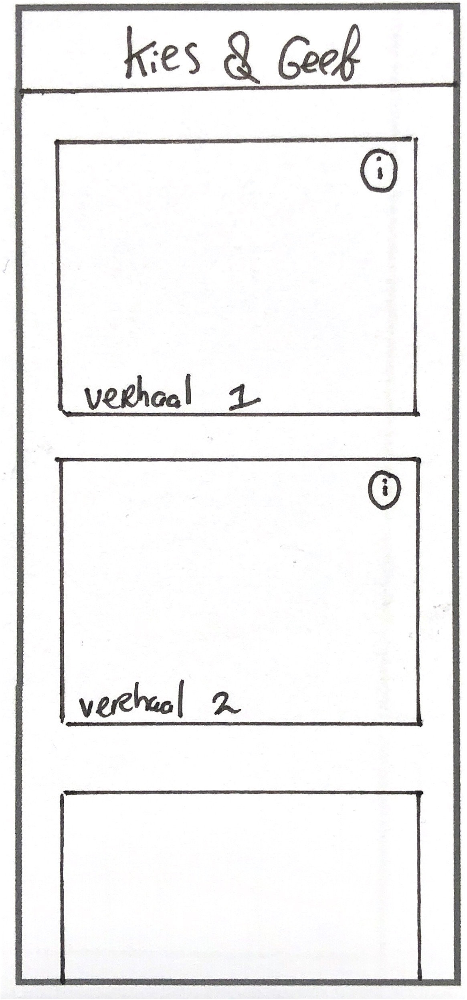
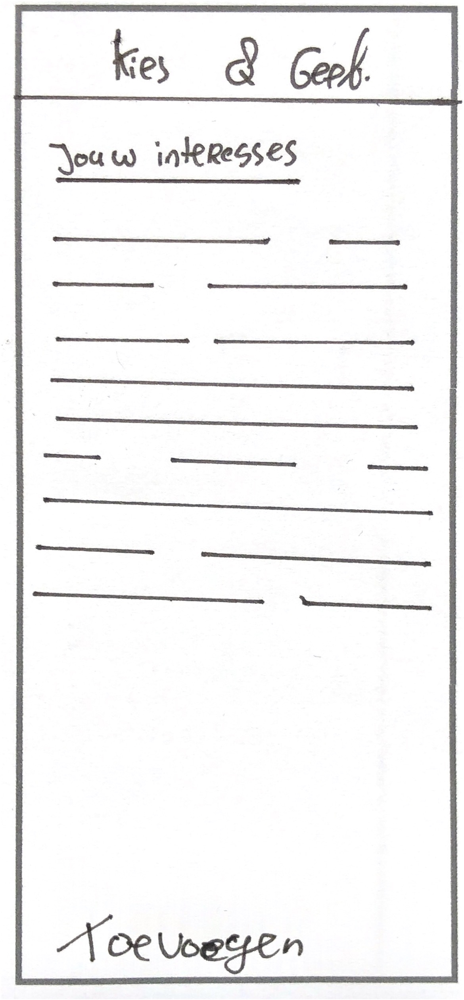

# 3 concepten

## Concept 1: Tinderen met Goede Doelen

Tinder is tegenwoordig enorm populair en zijn er al enorm veel manieren om op deze manier keuzes te maken. Zo kunnen we onze geliefdes vinden door middel van swipen en kunnen we ook al shoppen, waarom niet het kiezen van goede doelen via een tinder manier?

* Via een Tinder manier je goede doel kiezen.
* Herkenbaar
* Snel

## Concept 2: Switchen van Goede Doelen

Een concept waarbij het heel eenvoudig wordt om goede doelen stop te zetten. Het enige wat de gebruiker hoeft te doen, is het omzetten van een schakelaar ‘AAN/UIT’. Hierdoor kan de gebruiker ook daadwerlijk makkelijk switchen zonder het gevoel te hebben dat hij/zij hieraan vast zit. 

* Makkelijk kunnen switchen van goede doel.
* Meerdere goede doelen kunne doneren.
* Goede doel makkelijk kunnen opzeggen.

## Concept 3: **Persoonlijke goede doelen \(bij jou in de buurt\)**

Tegenwoordig wilt iedereen zich zelf zijn, als we kijken naar Facebook, Instagram enz. Het idee bij dit concept is dat dit een totaal persoonlijke app wordt. Goede doelen bij jou in de buurt worden uitgelicht, maar zo ook op hoeveel geld je doneert worden weer andere goede doelen getoond. Doordat alles uit te lezen is, op basis van geslacht, leeftijd, donatie bedrag en plaats is het mogelijk om voor iedereen een eigen profiel te maken.

* Een persoonlijke lijst op basis van...
  * Voorkeuren
  * Woonplaats
  * Bedrag

### 

### Conclusie

Uiteindelijk ben ik verder gegaan met een combinatie van het 2e en het 3e concept.

