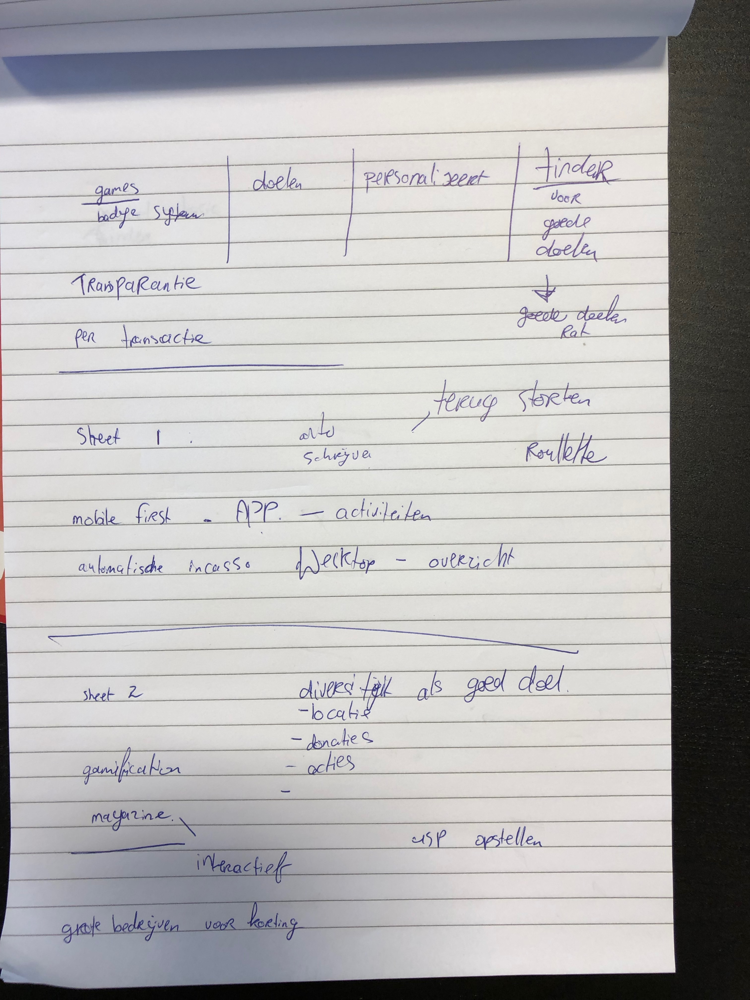

# Brainstormsessie

## **Inleiding**

op 1 april heb ik een brainstormsessie gehouden waaronder mijn opdrachtgever \(online marketing\) en nog twee andere collega’s \(Design en Development\). Ik heb bewust gekozen voor een diversiteit aan kennis om zo van alle kanten informatie te kunnen verkrijgen.

## **Doel**

Het doel van deze brainstormsessie is om tot drie verschillende concepten te komen die ik vervolgens wil uitwerken en wil presenteren op de Feedback Frenzy. Uiteindelijk wil ik één van deze concepten verder door trekken in het proces, maar is er ook een mogelijkheid om verschillende ideeën samen te voegen.

## **Het plan**

Tijdens mijn onderzoek ben ik tegen een aantal elementen aangelopen die ik wilde voorleggen in de groep. Ik heb een presentatie gemaakt met daarop de verschillende vragen die ik wilde tackelen. Het idee was d.m.v. deze oplossingen concepten konden genereren. Ook heb ik verschillende elementen van de “inspiration wall” aangekaart om zo dieper in het concept te komen.

## **Belangrijkste vragen voor de brainstormsessie**

* Wat is de beste flow voor de gebruikers om te doneren/switchen?
* Hoe krijgen we gebruikers weer terug bij het platform?
* Hoe gaan we om met de kosten?

## **Conclusie**

### **Wat is de beste flow voor de gebruikers om te doneren/switchen?**

Tijdens de brainstorm sessie is het idee naar voren gekomen om een app te ontwikkelen. Tijdens mijn stage kreeg ik ook altijd te horen als ik een design aan het maken was “Hoe ziet het er op mobiel uit?” Van mijn opdrachtgever heb ik ook te horen gekregen dat de meeste klanten van Immense de meeste acties uitvoeren op mobiel.

We wilde gebruikers geld laten storten op een platform waarbij ze dat geld bedrag kunnen verdelen. Waarbij gebruikers de vrijheid hebben en de mogelijkheid om het goede doel en het bedrag aan te kunnen passen.

### **Hoe krijgen we gebruikers weer terug bij het platform?**

Dit is vaak het moeilijkste stuk. Hierbij is mij gewezen om te kijken naar BJ Fogg, een model dat inzicht geeft over het gedrag van gebruikers, waar ik onderzoek naar ga doen. We kwamen ook op het idee om via een \(eventueel al bestaande\) game te ontwikkelen waarbij mensen het leuk moesten gaan vinden om te doneren.

### **Hoe gaan we winst maken en hoe gaan we om met de kosten?**

Al snel werd besloten dat er geen winst behaalt hoeft te worden. Wel moeten natuurlijk de kosten gedekt zijn en tijdens de brainstorm sessie kwam ook naar voren om een kleine vergoeding in te houden van de donaties als transactiekosten. Dit is het zelfde wat ik in mijn concurrentie analyse bij ‘Geef.nl' ben tegengekomen.

## **Bestanden**



