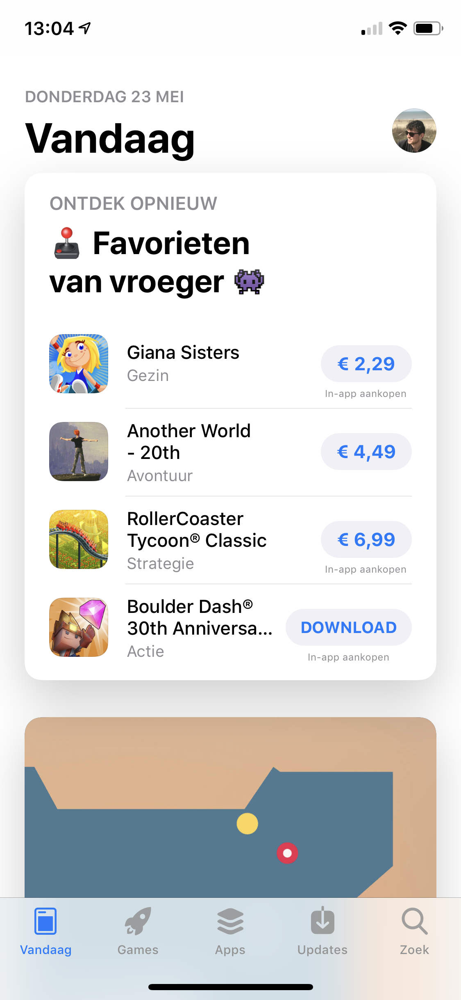
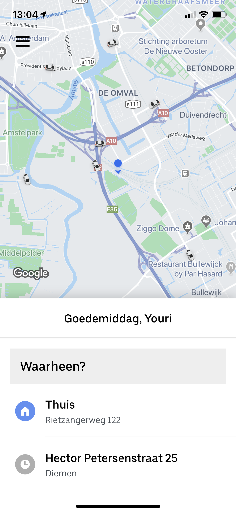
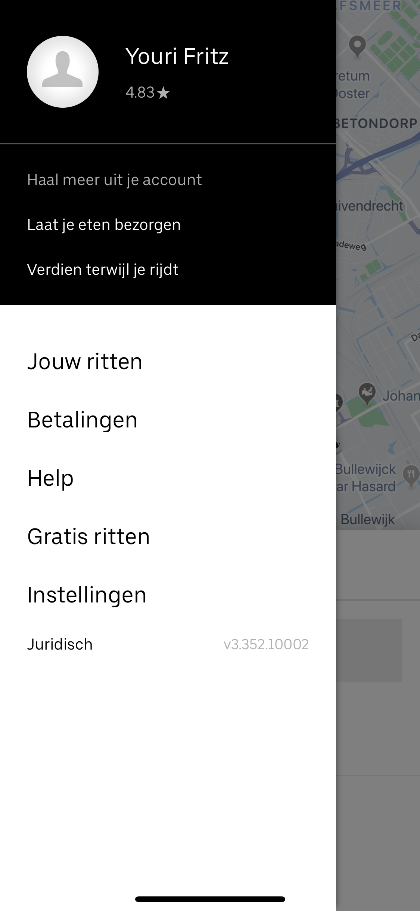
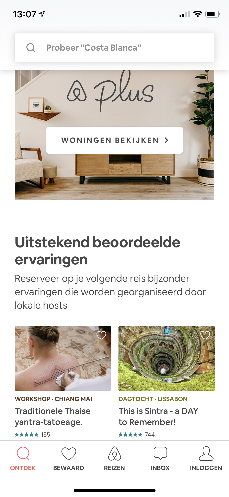

# Inspiratie design

## Inleiding

Voor dat ik ben begonnen met ontwerpen heb ik eerst research gedaan naar was de mogelijkheden zijn om zo meteen van slag te kunnen gaan zonder daar al te veel tijd voor te verliezen. Hieronder zijn maar wat aantekeningen voor mij zelf om eventueel toe te voegen in het desig.

## App Store Apple

Wat ik erg waardeer aan deze app is dat Apple de apps aanbied bij de gebruikers. Zo kunnen gebruikers door de pagina scrollen om zo te bekijken welke apps ze leuk lijken en welke ze eventueel willen downloaden/kopen. Ik heb wel online gevonden via deze website [https://www.iculture.nl/nieuws/opinie-apple-moet-meer-ontwikkelaars-kans-geven/](https://www.iculture.nl/nieuws/opinie-apple-moet-meer-ontwikkelaars-kans-geven/) dat apple wel voorkeur heeft op gebied van welke apps ze uitlichten. Voor mijn applicatie wil ik in eerste instantie gebruik maken met een 'goede doel van deze week' die is gebaseerd op het collecterooster. Om ervoor te zorgen dat er geen oneerlijke 'reclame' gemaakt wordt.

[https://www.iculture.nl/nieuws/opinie-apple-moet-meer-ontwikkelaars-kans-geven/](https://www.iculture.nl/nieuws/opinie-apple-moet-meer-ontwikkelaars-kans-geven/)

## **Uber**

Bij uber vind ik de kleuren combinatie zeer geslaagd. Het straat een strak, modern en zakelijk design uit. Dit komt door de witte, grijze en zwarte tinten. Met deze 'kleuren' wil ik ook mijn eerste opzet maken. Hierbij wil ik niet gebruik maken van kleuren, de kleuren van de goede doelen moeten hiervoor gaan zorgen waardoor ze meer opvallen.

## AirBNB

Airbnb maakt goed gebruik van meerdere elementen naast elkaar.

