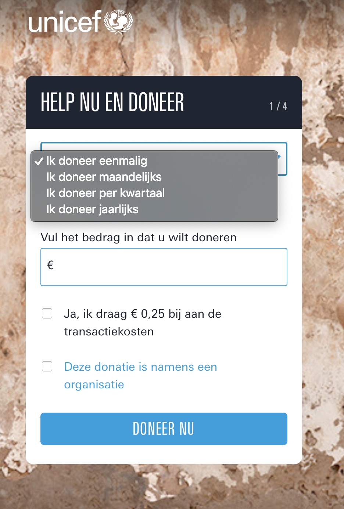
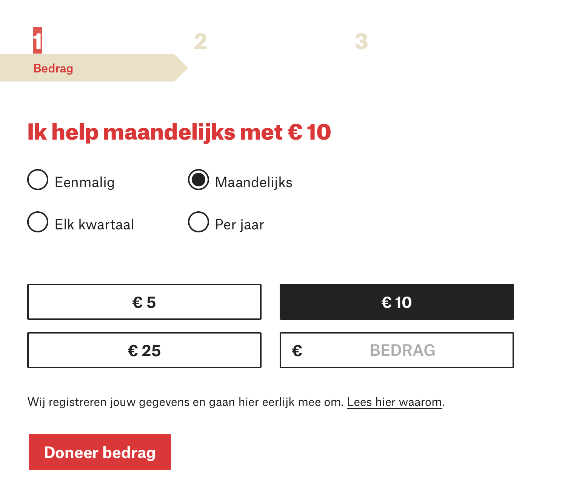
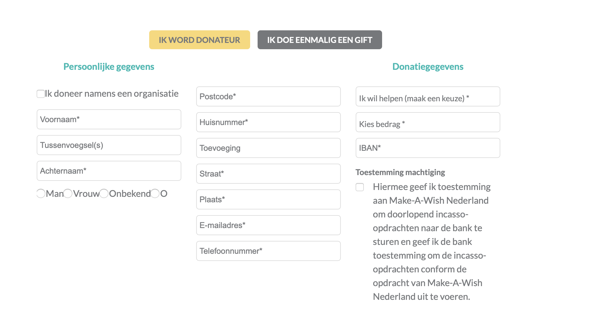
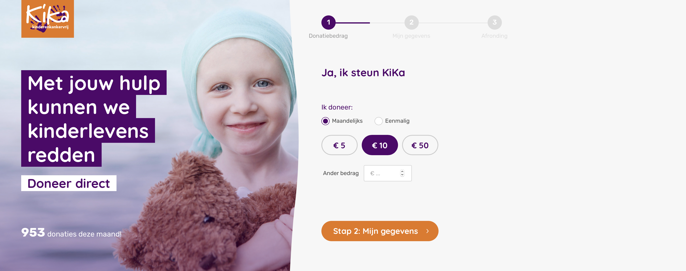

# Goede doelen organisaties \(online\)

### Inleiding

Eigenlijk zijn er geen concurrenten, maar zijn het meer andere platformen die geld willen ophalen. De goede doelen zelf zijn natuurlijk ook een platform waar gebruikers kunnen doneren. Ik ben dit gaan uitzoeken ~~voor~~ drie verschillende goede doelen: Unicef, Make a WIsh en War child.

### Resultaat

Eigenlijk geld het resultaat voor alle drie de organisaties het zelfde. Het bij  alle goede doelen organisaties mogelijk om via automatische afschrijving te doneren, maar ook voor een eenmalige actie

### Unicef

### War child

### Make a Wish

### WNF

### Kika

### Vernieuwingen

Ik heb het hiervoor al eerder over collectes gehad over het feit dat ze minder ophalen, maar de goede doelen zijn zich hier ook van bewust en ook het een en ander aan het ontwikkelen \(NOS, 2017a\). Zo kan er ook betaald worden met de pin. Uiteindelijk wil ik dat de gebruiker op ieder gewenst moment kan doneren en niet alleen als de goede doelen langs komen, dus zie ik dit niet als een oplossing voor mijn problemen.

