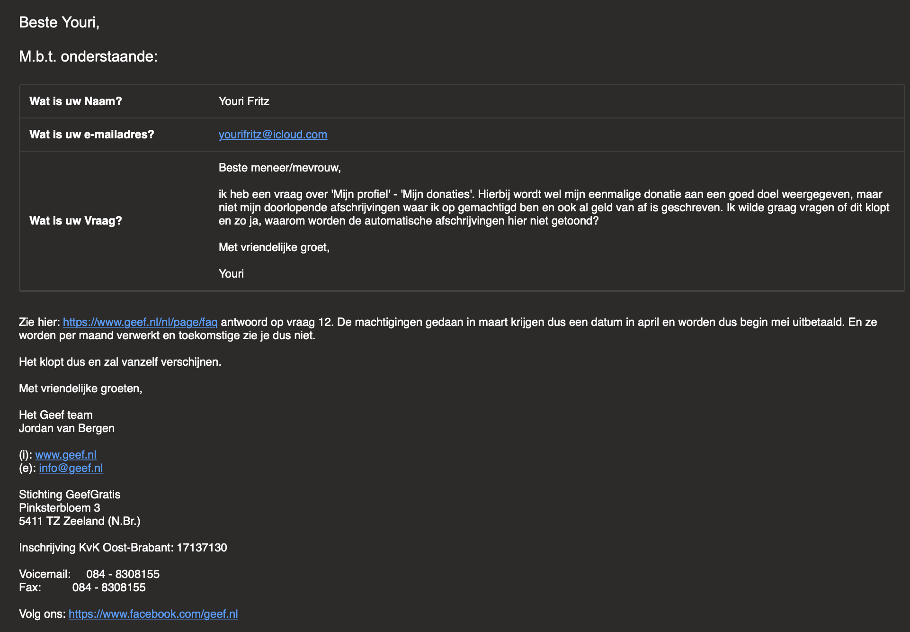

# Geef.nl

Wanneer je zoekt naar platformen om te doneren kom je al gauw bij ‘[geef.nl](http://geef.nl)' uit. Dit platform bestaat eigenlijk uit twee delen. Een geefactie starten, waarbij je als gebruiker geld kan inzamelen voor een goed doel. Dit kan een daadwerkelijk goed doel zijn bijvoorbeeld Unicef, maar ook door een eigen bedacht goed doel bijvoorbeeld Joran fiets de Stelvio voor Fonds Gehandicaptensport, [https://www.geef.nl/nl/actie/stelvio/donateurs](https://www.geef.nl/nl/actie/stelvio/donateurs). Ook is het mogelijk om te doneren aan goede doelen hoewel dit niet het belangrijkste focuspunt is van [geef.nl](http://geef.nl). Persoonlijk focus ik me het meeste op het tweede element ‘Doneer aan goede doelen’.

### **Welke manieren zijn er om te doneren?**

Zoals ik al vertelde zijn er twee manieren waaraan je kan doneren. Je kan doneren aan een gebruikers bedacht goede doel. Hierbij kan je via meerdere betaalmogelijkheden eenmalig doneren: iDeal, Creditcard, PayPal, Debitcard, Online overschrijving en via Bitcoin.

Als je kiest om een gecertificeerd goede doel te doneren bijvoorbeeld Unicef, dan zijn er vallen er mogelijkheden weg, maar komen er ook weer bij. Online overschrijving en Bitcoin vallen weg, maar daar komt doorlopende machtig voor in de plaats.

### **In hoeverre is het een oplossing voor mijn gevonden problemen?**

Omdat dit platform wel degelijk in de buurt komt als geschikte oplossing ben ik dit verder gaan uitzoeken, stap voor stap.

#### **stap 1: Homepagina**

Op de homepagina is goed te zien dat je meteen aan goede doelen kan doneren. Een duidelijke oranje knop’ leid je meteen naar het totaaloverzicht met filters om naar jou goede doel naar keuze te zoeken.

#### **stap 2: Totaaloverzicht van de goede doelen**

Een totaaloverzicht met alle goede doelen. Hier kan je filteren of zoeken naar het goede doel waar je graag aan zou willen doneren. Ik ben opzoek gegaan naar Unicef.

#### **stap 3: Goede doel Unicef**

Een detailpagina van een goed doel, in dit geval Unicef. Hier kan je informatie vinden over het goede doel. Welke geefacties gebruikers hebben opgezet voor Unicef, wie er de afgelopen tijd gedoneerd heeft, welke projecten er gekoppeld zijn en informatie over ANBI \(Algemeen Nut Beogende Instelling\).

#### **stap 4: Nu doneren**

Ik heb om objectief te blijven twee keer gedoneerd. Één keer eenmalig en een keer via doorlopende machtiging. Hierin zat zelf niet heel veel verschil, maar hier kom ik later nog op terug.

#### **stap 5: Het overzicht**

Wanneer je bent ingelogd kan je in een overzicht zien waar je aan hebt gedoneerd. Wel is het zo dat de automatische afschrijving pas later in dit overzicht te zien is, wanneer het wel van mijn rekening is afgehaald.

### **Welke elementen zijn interessant voor mijn oplossing?**

De manier van doneren is zeker interessant om mee te nemen naar mijn oplossing. De vele betaalopties zijn ideaal waardoor de gebruiker zijn eigen vrijheid heeft om een keuze te maken om te doneren.

Daarnaast staat er bij [geef.nl](http://geef.nl) in de voorwaarden dat er 95% van alle inkomsten naar de goede doelen gaat. Dit houd in dat 5% van de inkomsten naar [geef.nl](http://geef.nl) gaat om bijvoorbeeld de kosten te dekken.

### **Conclusie**

Geef.nl doet een goede poging om als oplossing voor mijn gevonden problemen, maar missen ze wel degelijk een aantal essentiële elementen die het voor de gebruiker nog beter zou maken. Zo kan je niet via [geef.nl](http://geef.nl) een automatische afschrijving stopzetten en wordt je als gebruiker door gelinkt naar het goede doel zelf, waardoor het stopzetten als nog als lastig beschouwd wordt.

