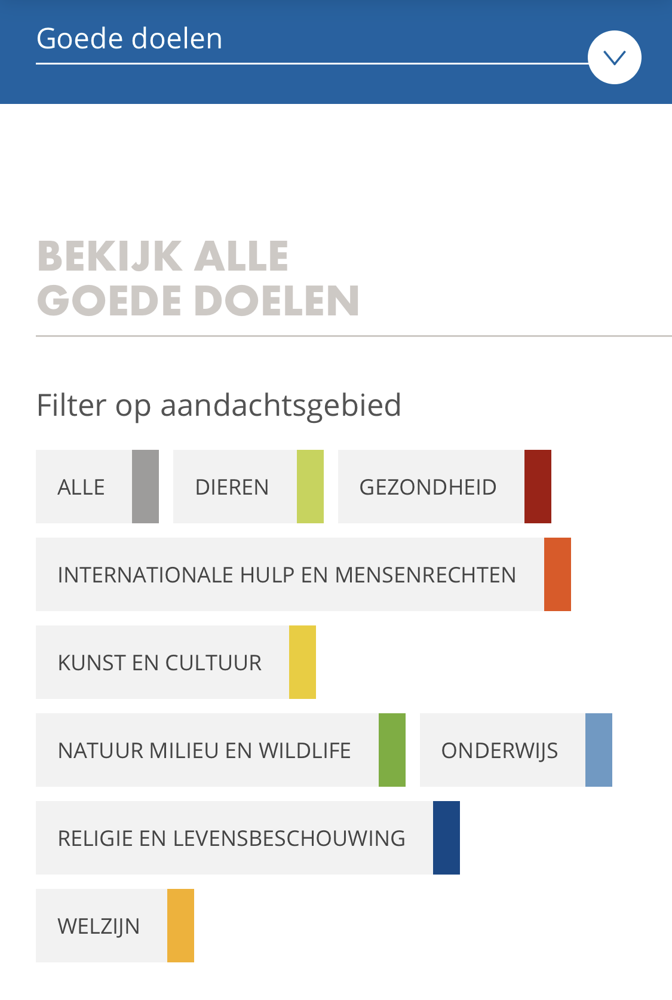

# Goededoelen.nl

### **Welke manieren zijn er om te doneren?**

Er is op de website zelf geen manier om te doneren. Goededoelen.nl is voornamelijk informatie website alle goede doelen. Hier is allerlei informatie te vinden over de goede doelen zelf of in het algemeen. Je kan alleen doneren wanneer je door gelinkt wordt naar de desbetreffende website.

### **In hoeverre is het een oplossing voor mijn gevonden problemen?**

De website is door het feit dat het alleen maar een informatieve website is dus ook geen oplossing.

### **Welke elementen zijn interessant voor mijn oplossing?**

Goede doelen maakt gebruik van categorieën die ik zeer handig vind. Hiermee kan je een grote scala aan goede doelen categoriseren. In de survey kwam ook naar voren dat wanneer een persoon geld doneert aan het milieu zich zelf ook betrokken voelt aan het milieu. Zo kunnen ze makkelijk ook andere goede doelen vinden om aan te doneren, die dicht bij hun staan.

### **Wat is de conclusie?**

Ze zijn niet de mogelijke oplossing waar ik naar opzoek ben. Wel kan ik zeker gebruik maken van het feit dat ze al verschillende categorieën hebben. Ook biedt het veel informatie over de goede doelen zelf en informatie over andere onderwerpen die dicht bij de goede doelen staan, zoals ANBI en het collecteren wat ik ga gebruiken om meer inzichten te krijgen over goede doelen en wat er nog bij komt kijken.

