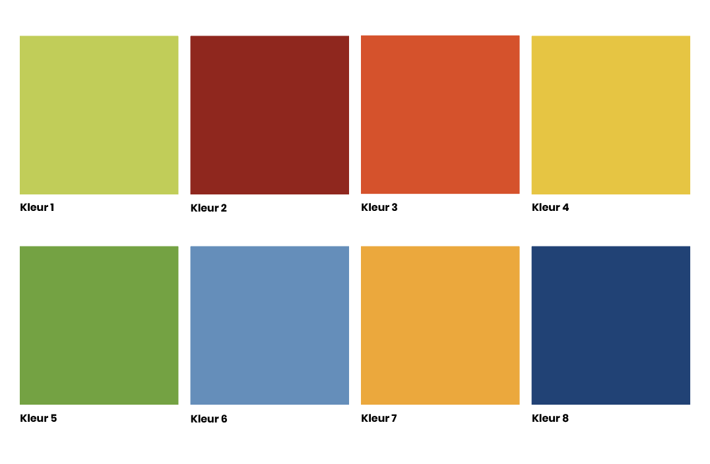
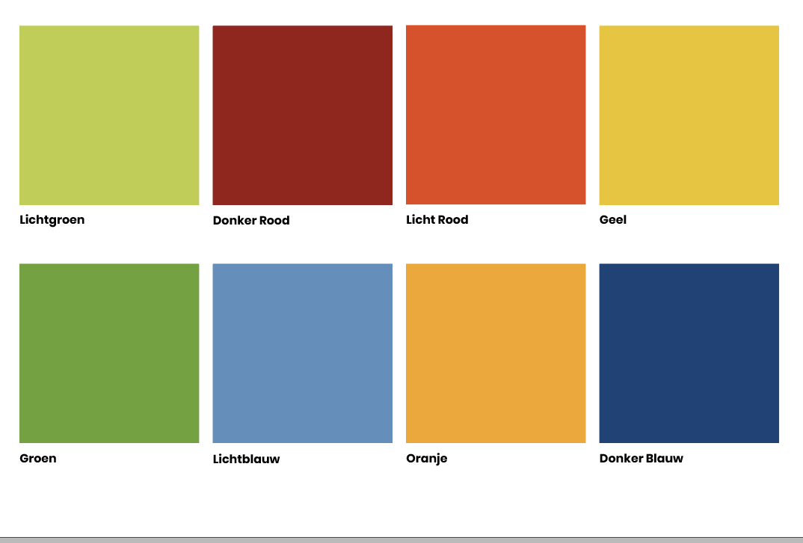

# Kleurenblindheid Test

Bij mijn afstudeerbedrijf heb ik een collega die kleurenblind is. Samen hebben we het veel over ontwerpen die hier op zouden kunnen inspelen en heb ik hem gevraagd om samen met mij een klein testje te doen. Één persoon is natuurlijk niet genoeg voor een valide test, maar wel een begin. Zo kan ik dit mee nemen voor in mijn aabeveling, om hier vervolgens op te gaan letten.

### De test

Ik heb bewust ook voor de antwoorden gekozen, zodat ik niet achteraf kon zeggen of de testpersoon het goed of fout had. 

### Resultaten

Testpersoon had bij kleur 4, groen geantwoord. Dit is de enige kleur die hij fout had. Echter is het wel zo dat ik deze test geprint heb afgenomen, later zijn we het digitaal gaan doen en merkten we dat Kleur 4 en Kleur 5 voor hem het zelfde waren. Kleur 7 werd ook moeilijker waar te nemen door het beeldscherm.

